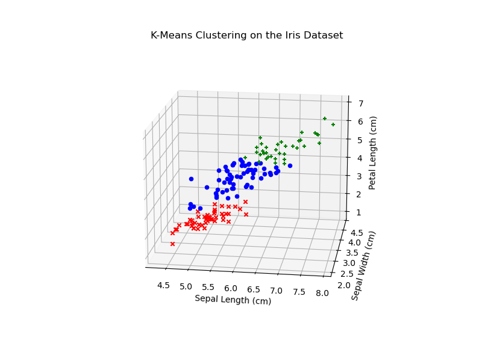
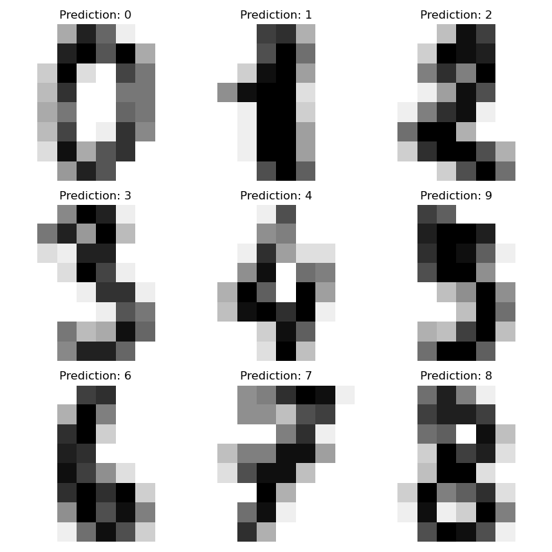
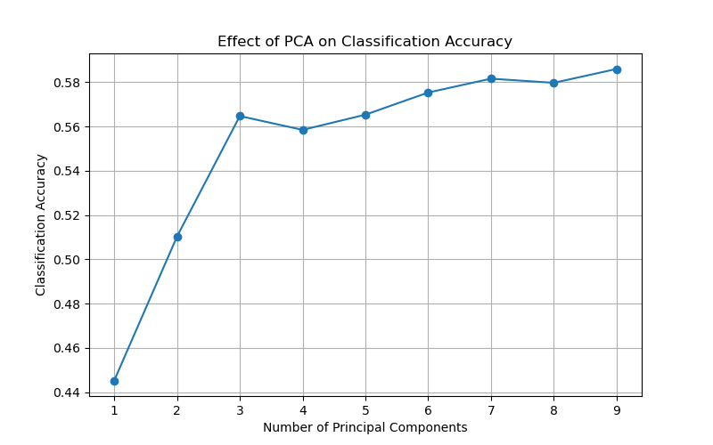

# Machine Learning Examples in Python

A collection of well-documented Python examples demonstrating fundamental machine learning algorithms and data preprocessing techniques using **scikit-learn** and **NumPy**.

The goal of this repository is to provide educational implementations of common machine learning techniques, ranging from clustering and classification to dimensionality reduction and neural networks.

---

## Repository Structure

```text
machine-learning-examples/
│
├── classification/
│   ├── digits_classification.py
│   └── svm_iris.py
│
├── clustering/
│   └── kmeans_iris.py
│
├── preprocessing/
│   └── pca_wine_quality.py
│
├── neural_networks/
│   └── perceptron_from_scratch.py
│
├── data/
│   └── winequality-red.csv
│
├── images/
│   ├── digits_predictions.png
│   ├── kmeans_result.png
│   └── pca_accuracy.png
│
├── requirements.txt
├── .gitignore
└── README.md
```

---

## Examples

### K-Means Clustering

Performs unsupervised clustering on the Iris dataset using the K-Means algorithm and visualizes the resulting clusters in a 3D scatter plot.

<p align="center">
    
</p>

---

### Support Vector Machines

Implements binary classification on the Iris dataset using three different approaches:

- Linear Support Vector Machine
- Linear Support Vector Machine with Polynomial Features
- Polynomial Kernel Support Vector Machine

The example demonstrates the use of feature scaling, pipelines, and kernel methods for binary classification.

---

### Handwritten Digit Classification

Compares two supervised learning algorithms using the Digits dataset:

- Gaussian Naive Bayes
- Support Vector Machine

The performance of each classifier is evaluated using accuracy and confusion matrices.

<p align="center">
    
</p>

---

### Principal Component Analysis (PCA)

Applies Principal Component Analysis (PCA) to the Wine Quality dataset and evaluates how the number of principal components affects the classification performance of a Gaussian Naive Bayes classifier.

<p align="center">
    
</p>

---

### Perceptron from Scratch

Implements the Perceptron learning algorithm using only NumPy, demonstrating weight initialization, online learning, and binary classification without relying on machine learning libraries.

---

## Requirements

Install the required dependencies:

```bash
pip install -r requirements.txt
```

---

## Dependencies

- NumPy
- Pandas
- Matplotlib
- scikit-learn

---

## Datasets

### Built-in datasets (scikit-learn)

The following datasets are included with scikit-learn and require no additional downloads:

- Iris Dataset
- Digits Dataset

### Local dataset

The PCA example requires the following dataset:

```text
data/
└── winequality-red.csv
```

---

## Running the Examples

Run any script from the repository root.

```bash
python clustering/kmeans_iris.py
```

```bash
python classification/svm_iris.py
```

```bash
python classification/digits_classification.py
```

```bash
python preprocessing/pca_wine_quality.py
```

```bash
python neural_networks/perceptron_from_scratch.py
```

---

## Topics Covered

- Machine Learning Fundamentals
- Data Preprocessing
- Feature Scaling
- Clustering
- K-Means
- Support Vector Machines (SVM)
- Gaussian Naive Bayes
- Principal Component Analysis (PCA)
- Artificial Neural Networks
- Perceptron Learning Algorithm
- Binary Classification
- Multiclass Classification
- Confusion Matrix
- Accuracy Evaluation
- Pipelines

---

## License

This repository is intended for educational purposes.